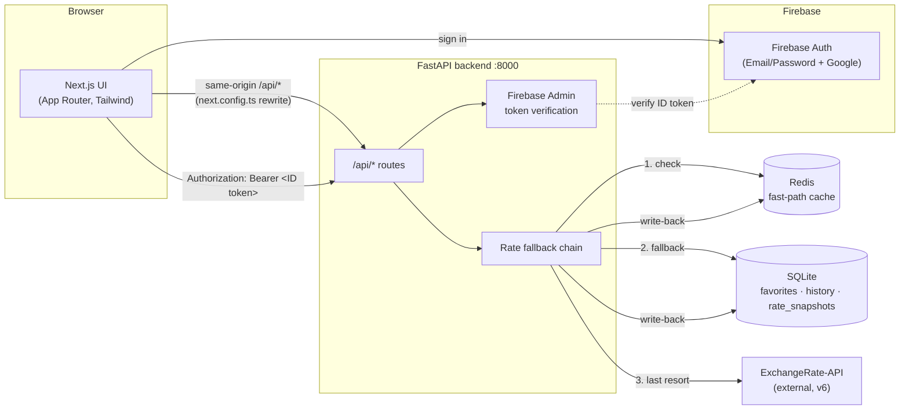

# 💱 Rate Board — Currency Converter

Real-time currency conversion with a 30-day trend chart, favorites, and a
Travel Budgeting mode — built as a decoupled FastAPI backend + Next.js
frontend, cached through Redis and SQLite so exchange-rate lookups cost at
most one external API call per currency pair per day.

[](https://nextjs.org)
[](https://react.dev)
[](https://fastapi.tiangolo.com)
[](https://www.python.org)
[](https://redis.io)
[](https://sqlite.org)
[](https://firebase.google.com/docs/auth)
[](https://www.typescriptlang.org)
[](docs/CHANGELOG.md)

---

## Table of Contents

- [Features](#-features)
- [Architecture](#-architecture)
- [Tech Stack](#-tech-stack)
- [Getting Started](#-getting-started)
- [API Overview](#-api-overview)
- [Project Structure](#-project-structure)
- [Security & Privacy](#-security--privacy)
- [Known Limitations](#-known-limitations)
- [Versioning & Changelog](#-versioning--changelog)
- [License](#-license)

## ✨ Features

- 🔄 **Dual Converter** — live source/target dropdowns with an amount field,
  debounced live conversion, one-click swap.
- 📈 **30-Day Trend Chart** — a self-building daily snapshot per currency
  pair, rendered as a line chart.
- ⭐ **Favorites** — save frequently used currency pairs, scoped privately to
  your signed-in account.
- 🧳 **Travel Budgeting Mode** — enter one base amount, see it converted
  across 5 major currencies (`USD, EUR, GBP, JPY, AUD`) at once.
- 🔐 **Firebase Auth** — email/password + Google sign-in; favorites and
  conversion history are private per user, enforced server-side.
- ⚡ **Redis → SQLite → API fallback chain** — fast-path cache, durable
  last-known-good fallback, and a hard ceiling of one external API call per
  pair per UTC day.

## 🏗️ Architecture



The ExchangeRate API key and Firebase service-account credentials live only
in the backend's environment — the frontend never sees them, only calls its
own `/api/*` routes.

## 🧱 Tech Stack

| Layer | Choice |
|---|---|
| Frontend | Next.js 16 (App Router) · React 19 · TypeScript · Tailwind CSS v4 |
| Auth | Firebase Auth (client SDK) + Firebase Admin (server-side token verification) |
| Backend | Python · FastAPI · uvicorn |
| Cache | Redis (fast-path, TTL aligned to UTC midnight) |
| Durable store | SQLite (favorites, conversion history, daily rate snapshots) |
| External data | [ExchangeRate-API](https://www.exchangerate-api.com) v6 |
| Package managers | `bun` (frontend) · `uv` (backend) |
| Infra | Docker Compose (Redis) |

## 🚀 Getting Started

### Prerequisites

- Docker + Docker Compose
- An [ExchangeRate-API](https://www.exchangerate-api.com) key (free tier works)
- A [Firebase](https://console.firebase.google.com) project with Email/Password
  and Google sign-in enabled, plus a service account JSON
- For native development instead of Docker: [Bun](https://bun.sh) and
  Python 3.13+ with [`uv`](https://docs.astral.sh/uv/)

### Run it — Docker Compose (recommended)

```bash
cp .env.example .env                     # NEXT_PUBLIC_FIREBASE_* — build args for the frontend image
cp backend/.env.example backend/.env     # fill in EXCHANGERATE_API_KEY
# drop backend/firebase-service-account.json in place (gitignored)

docker compose up -d --build
```

- App: [http://localhost:3000](http://localhost:3000)
- Swagger UI: [http://localhost:8000/docs](http://localhost:8000/docs)

All three services (Redis, FastAPI, Next.js) run as containers. SQLite
persists on the host via a bind mount, Redis via a named volume.

### Run it — native, two terminals (hot reload)

```bash
docker compose up -d redis

# Terminal A
cd backend && uv venv && uv pip install -r requirements.txt
cp .env.example .env && source .venv/bin/activate
uvicorn app.main:app --reload --port 8000

# Terminal B
cd frontend && bun install
cp .env.local.example .env.local
bun dev
```

Full setup detail, every environment variable, and the SQLite schema are in
[`docs/implementation.md`](docs/implementation.md).

## 📡 API Overview

| Method | Endpoint | Auth | Description |
|---|---|:---:|---|
| `GET` | `/api/currencies` | – | Supported currency codes |
| `GET` | `/api/convert` | optional | Convert an amount, `base` → `target` |
| `GET` | `/api/trend` | – | Last 30 daily rate snapshots for a pair |
| `POST` | `/api/budget` | – | Travel Budgeting — 5-currency comparison |
| `GET`/`POST` | `/api/favorites` | ✅ | List / save a favorite currency pair |
| `DELETE` | `/api/favorites/{id}` | ✅ | Remove a favorite |
| `GET` | `/api/history` | ✅ | Your recent conversions |

Full request/response shapes, error format, and the Redis → SQLite → API
fallback chain are documented in
[`docs/implementation.md`](docs/implementation.md).

## 📁 Project Structure

```
.
├── backend/                Python FastAPI service
│   ├── Dockerfile
│   └── app/
│       ├── routers/        currencies · convert · trend · budget · favorites · history
│       ├── services/       exchange_rate_client · redis_cache · rates (fallback chain)
│       ├── auth.py         Firebase ID token verification
│       └── db.py           SQLite schema + queries
├── frontend/                Next.js app
│   ├── Dockerfile
│   ├── app/                 converter · budget · history · login
│   ├── components/          UI components
│   ├── context/              AuthContext (Firebase)
│   └── lib/                  api client, types, fixtures
├── docker-compose.yml        redis + backend + frontend
├── docs/
│   ├── implementation.md     API contract & architecture (source of truth)
│   └── CHANGELOG.md
├── VERSION
└── CLAUDE.md                 project + versioning guide for AI-assisted work
```

## 🔒 Security & Privacy

- Every protected route resolves identity **only** from a server-verified
  Firebase ID token — no endpoint accepts a `user_id` from the client, so one
  user can never read or modify another's favorites/history.
- SQLite stores only the opaque Firebase UID, never email/profile data.
- The ExchangeRate API key and Firebase service-account credentials are
  backend-only, gitignored, and never sent to or readable by the frontend.
- `rate_snapshots` is public market data, safe to cache/share across all users.

## ⚠️ Known Limitations

- ExchangeRate-API's Historical Data endpoint requires a paid plan, so the
  30-day trend is **self-built**: one snapshot per pair per UTC day, meaning
  the chart starts sparse on a fresh pair and fills in over the following
  weeks rather than showing 30 days immediately.
- Favorites/history require a Firebase service-account file in `backend/`
  that isn't checked in — the app runs without it, but those two endpoints
  will 401 until it's added.

## 📓 Versioning & Changelog

This project tracks a single version in [`VERSION`](VERSION)
(semver), bumped for every change alongside a matching entry in
[`docs/CHANGELOG.md`](docs/CHANGELOG.md). See [`CLAUDE.md`](CLAUDE.md) for the
full policy.

## 📄 License

No license specified — this is a take-home/interview project, not intended
for external reuse or distribution.
